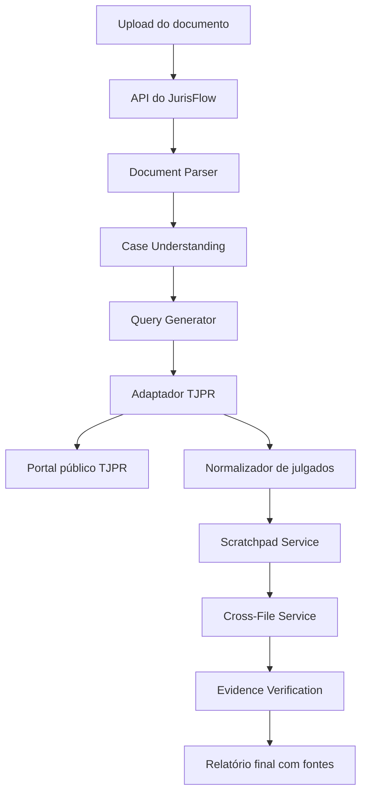

# JurisFlow — Contexto Técnico Geral (Consolidado)

## 0. Nota de proveniência

Este arquivo consolida dois documentos de planejamento anteriores:

- `contexto1.md` — especificação técnica ampla do "Motor de Análise Jurisprudencial com Scratchpad Files" (arquitetura, pipeline, resiliência, persistência).
- `contexto2.md` — escopo de produto do "JurisFlow" para o Hackathon da Cidadania OAB-PR 2026 (stack, investigação da fonte TJPR, time, pitch).

Os dois arquivos originais permanecem no repositório e não devem ser apagados. **A partir de agora, este arquivo (`contexto-geral.md`) é a fonte de verdade** para a implementação. Onde os dois documentos originais divergiam, as decisões abaixo foram tomadas explicitamente (não por omissão):

1. **Modelo de entrada**: o fluxo principal é **upload de documento jurídico** (petição, contestação, decisão, recurso, intimação, manifestação) — não um formulário de "tese + palavras-chave". O sistema extrai a tese, os fatos e as questões jurídicas automaticamente do documento enviado.
2. **Nível de arquitetura**: a arquitetura completa de resiliência do `contexto1.md` (retry com backoff, circuit breaker, persistência estruturada, hooks PreToolUse/PostToolUse, idempotência) é adotada **desde já**, não como evolução futura. Isso amplia o escopo em relação ao plano original do hackathon e tem implicação direta de prazo — é um risco assumido conscientemente, não um bloqueio.
3. **Time e pitch**: mantidos como seção de referência (§13), não como especificação técnica.
4. **Gap identificado nesta consolidação** (não coberto por nenhum dos dois documentos originais): como o fluxo agora aceita upload de petições reais — que podem conter nome de cliente, CPF, endereço etc. — é necessário um passo de **sanitização/anonimização de dados pessoais** antes de qualquer envio de texto ao modelo. Ver §8.

---

## 1. Visão geral do produto

**JurisFlow** é um assistente que recebe um documento jurídico enviado pelo advogado e devolve um relatório jurisprudencial estruturado, fundamentado e rastreável sobre o TJPR: quais decisões fortalecem a tese, quais contrariam, e quais são indeterminadas — sempre com link para a fonte oficial.

Ele apoia a preparação de recursos e petições. **Não promete resultado processual, não substitui análise jurídica e não recomenda peça pronta sem revisão humana.**

O princípio central é:

> O modelo não deverá receber dezenas de decisões completas simultaneamente.

Cada decisão candidata é analisada de forma independente e convertida em uma representação intermediária compacta — o **Scratchpad File**. A análise global (cross-file) roda sobre os Scratchpads; as decisões originais são reabertas na etapa final de verificação de evidências.

### Problema

Hoje, para entender como um órgão julgador trata uma tese, o advogado pesquisa por palavras-chave, abre manualmente muitas ementas e decide o que é relevante — processo lento, desigual, e que pode deixar passar precedente contrário importante. Além disso, jogar dezenas de documentos completos no contexto de um LLM causa attention dilution, perda de informação no meio do contexto, maior custo/latência, dificuldade de rastrear origem e risco de confundir decisões entre si.

O objetivo não é "adivinhar o juiz", é **reduzir pesquisa manual e transformar jurisprudência pública dispersa em evidência organizada e rastreável**.

### Usuário e cenário de demonstração

- Usuário principal: advogado autônomo, advogado de escritório ou estagiário supervisionado.
- Experiência: web app responsivo, mobile-first (o portal do TJPR não é confortável em telas pequenas).
- Cenário demonstrável: um documento real (ex.: petição sobre dano moral por negativação indevida) é enviado, e o sistema retorna decisões favoráveis, contrárias e indeterminadas da Câmara relevante do TJPR.
- A interface deve deixar claro que a classificação é uma **triagem de pesquisa**, não um parecer nem previsão de êxito.

---

## 2. Princípios arquiteturais

### 2.1 Structured First

Todas as etapas internas relevantes produzem dados estruturados. Não depender de parsing de texto livre quando um JSON estruturado e validado puder ser usado.

### 2.2 Source of Truth

O Scratchpad File **não** é a fonte jurídica oficial — é derivado para sumarização, classificação, comparação, ranking e raciocínio cross-file. O documento original (petição do usuário e decisões do TJPR) continua sendo a autoridade. **Toda citação apresentada ao usuário deve ser validada contra a fonte original** antes de aparecer no relatório final.

### 2.3 Map → Reduce → Verify

```text
MAP     — cada decisão é analisada isoladamente → 1 Scratchpad por decisão
REDUCE  — os Scratchpads são analisados em conjunto → padrões, precedentes prioritários
VERIFY  — os precedentes selecionados são reabertos na fonte original → evidência validada
```

Essas três responsabilidades nunca se misturam: nenhuma etapa de Reduce lê documentos originais, e nenhuma etapa de Verify decide "quem ganha" — apenas confirma se a citação existe de fato na fonte.

---

## 3. Pipeline principal

```text
UPLOAD DO DOCUMENTO
        ↓
DOCUMENT PARSING
        ↓
CASE UNDERSTANDING
        ↓
QUERY GENERATION
        ↓
JURISPRUDENCE SEARCH (TJPR)
        ↓
PRE-RANKING
        ↓
TOP N DECISIONS (≤ 10)
        ↓
FETCH ORIGINAL DECISIONS
        ↓
PARALLEL SCRATCHPAD GENERATION
        ↓
SCRATCHPAD VALIDATION
        ↓
CROSS-FILE ANALYSIS
        ↓
PRECEDENT RANKING
        ↓
DEEP EVIDENCE VERIFICATION
        ↓
FINAL REPORT
```

### 3.1 Etapa 1 — Ingestão do documento

Formatos suportados inicialmente: PDF, DOCX, TXT (imagens/OCR ficam como expansão futura).

```ts
interface ParsedDocument {
  documentId: string;
  fileName: string;
  mimeType: string;
  text: string;
  pages?: ParsedPage[];
  metadata: {
    pageCount?: number;
    hash: string;
  };
}
```

### 3.2 Etapa 2 — Case Understanding

Um agente interpreta exclusivamente o documento enviado e extrai:

```ts
interface CaseAnalysis {
  processNumber?: string;
  court?: string;
  chamber?: string;
  judge?: string;
  parties: { plaintiff?: string; defendant?: string; others?: string[] };
  caseClass?: string;
  facts: string[];
  requests: string[];
  legalIssues: {
    id: string;
    topic: string;
    question: string;
    relevance: "HIGH" | "MEDIUM" | "LOW";
  }[];
  clientArguments: string[];
  opposingArguments: string[];
  citedLaws: string[];
  citedPrecedents: string[];
  evidenceSummary: string[];
}
```

> Antes desta etapa processar o texto, aplicar a sanitização de dados pessoais descrita em §8.3.

### 3.3 Etapa 3 — Query Generation

A partir do `CaseAnalysis`, gerar múltiplas queries de pesquisa (não apenas uma), cada uma com uma razão explícita:

```json
{
  "queries": [
    { "query": "\"dano moral\" \"falha na prestação de serviço\"", "reason": "Busca pela tese principal." },
    { "query": "\"mero aborrecimento\" consumidor", "reason": "Busca por decisões contrárias." },
    { "query": "\"dano moral in re ipsa\"", "reason": "Busca por tese jurisprudencial correlata." }
  ]
}
```

### 3.4 Etapa 4 — Busca de jurisprudência (TJPR)

```ts
interface JurisprudenceProvider {
  search(query: JurisprudenceQuery): Promise<ToolResult<JurisprudenceSearchResult>>;
  fetchDecision(decisionId: string): Promise<ToolResult<RawDecision>>;
}

interface JurisprudenceSearchItem {
  id: string;
  processNumber?: string;
  title?: string;
  court: string;
  chamber?: string;
  judge?: string;
  judgmentDate?: string;
  summary?: string;
  url: string;
  source: "TJPR";
}
```

Nenhum componente de UI ou de negócio chama o portal do TJPR diretamente — tudo passa por este provider (ver §5 para o adapter concreto e o plano de validação em §9).

### 3.5 Pre-ranking

Critério de score sugerido (ajustável conforme dados disponíveis):

```text
35% similaridade jurídica
20% mesma Câmara
15% mesmo relator
10% mesma classe
10% mesmo assunto
10% recência
```

### 3.6 Etapa 5 — Scratchpad Files

Cada decisão selecionada é analisada isoladamente — nunca todas juntas na mesma chamada:

```text
Decision 01 → Agent → Scratchpad 01
Decision 02 → Agent → Scratchpad 02
Decision 03 → Agent → Scratchpad 03
```

```ts
interface DecisionScratchpad {
  scratchpadId: string;
  schemaVersion: string;
  source: {
    provider: "TJPR";
    sourceId: string;
    url: string;
    processNumber?: string;
    court?: string;
    chamber?: string;
    judge?: string;
    judgmentDate?: string;
    sourceHash: string;
  };
  relevance: { score: number; reason: string };
  caseSummary: string;
  facts: string[];
  legalIssues: string[];
  holdings: {
    proposition: string;
    stance: "SUPPORTS" | "OPPOSES" | "NEUTRAL" | "MIXED";
    reasoning: string;
  }[];
  favorablePoints: string[];
  contraryPoints: string[];
  distinguishingFacts: string[];
  citedLaws: string[];
  citedPrecedents: string[];
  evidenceCandidates: {
    id: string;
    quote: string;
    context: string;
    purpose: string;
    sourceLocation?: string;
  }[];
  confidence: number;
  status: "VALID" | "PARTIAL" | "FAILED";
}
```

**Regra fundamental**: a classificação nunca é um rótulo único por decisão ("decisão favorável"). Ela é feita **por proposição jurídica**, e uma mesma decisão pode ter múltiplas posições:

```text
SUPPORTS: responsabilidade objetiva
SUPPORTS: existência de dano
OPPOSES:  valor indenizatório solicitado
```

### 3.7 Processamento paralelo

Não é necessário Kafka, RabbitMQ, workers distribuídos ou Kubernetes Jobs. Um pool de execução concorrente é suficiente — **3 a 5 workers** é a sugestão inicial. O usuário recebe o resultado no mesmo fluxo da solicitação (sem batch assíncrono offline).

### 3.8 Cross-File Analysis

Depois de todos os Scratchpads válidos gerados, uma análise global recebe `CaseAnalysis` + questões jurídicas + Scratchpads + IDs das decisões — **não os documentos originais**.

```ts
interface CrossFileAnalysis {
  legalIssueId: string;
  conclusion: string;
  supportingDecisions: string[];
  opposingDecisions: string[];
  mixedDecisions: string[];
  chamberPattern?: string;
  recurringFactors: string[];
  strongestSupporting: string[];
  strongestOpposing: string[];
  risks: { description: string; evidenceIds: string[] }[];
  suggestedArguments: { argument: string; evidenceIds: string[] }[];
}
```

### 3.9 Evidence Verification (etapa obrigatória)

O relatório final **nunca** é produzido diretamente a partir dos Scratchpads. Os melhores precedentes selecionados no cross-file (ex.: 3 favoráveis, 2 contrários, 1 distinguishing) têm suas decisões originais reabertas e cada citação é validada:

```ts
interface VerifiedEvidence {
  evidenceId: string;
  scratchpadId: string;
  proposition: string;
  quote: string;
  context: string;
  source: {
    processNumber?: string;
    court?: string;
    chamber?: string;
    judge?: string;
    judgmentDate?: string;
    url: string;
    sourceHash: string;
  };
  verified: boolean;
}
```

**Regra anti-alucinação**: o relatório final só pode usar uma decisão como fundamento quando existir um `VerifiedEvidence` associado à afirmação:

```text
argumento → evidenceId → VerifiedEvidence → fonte original
```

Toda afirmação relevante carrega provenance explícita:

```json
{
  "claim": "A Câmara tende a considerar o mero inadimplemento insuficiente para gerar dano moral.",
  "sources": ["EVIDENCE_01", "EVIDENCE_04", "EVIDENCE_07"]
}
```

### 3.10 Relatório final

Seções: resumo do caso, questões jurídicas analisadas, tendência jurisprudencial (ex.: "6 de 10 decisões sustentam a tese principal, 3 contrárias, 1 mista"), pontos favoráveis (com argumento, precedente, Câmara, relator, data, trecho, URL), pontos contrários (mesma estrutura), principais riscos, distinguishing, estratégia argumentativa sugerida.

Evitar métricas enganosas como "83% de chance de ganhar". Preferir: alta/moderada convergência jurisprudencial, jurisprudência dividida, baixa quantidade de precedentes relevantes. Um score numérico interno não deve ser apresentado como probabilidade jurídica.

---

## 4. Fontes de dados

### 4.1 Documento enviado pelo advogado (fonte primária de contexto)

Fonte para: fatos, partes, pedidos, teses, argumentos adversos, contexto processual, referências legais, número do processo, Câmara (quando disponível).

### 4.2 Jurisprudência TJPR (fonte primária de decisões — única implementada agora)

Portal público: `https://portal.tjpr.jus.br/jurisprudencia/publico/`.

Achados da investigação manual já registrados:

- A consulta pública aparenta funcionar sem login para pesquisa comum.
- Em teste com "plano de saúde", o portal exibiu 3.970 resultados.
- Os termos/filtros não ficam expostos de forma clara na URL — a página provavelmente faz uma requisição de fundo, mas **o endpoint, método e contrato ainda não foram confirmados**.
- A interface permite restringir a pesquisa e controlar o tamanho da página (opções observadas: 20 e 50 itens), além de metadados e links dos julgados.
- Retorno esperado mínimo: número/link do processo, órgão julgador, relator (quando presente), data, ementa e inteiro teor (quando disponível).
- É necessário tanto material favorável quanto decisões contrárias — estas últimas ajudam a identificar risco e refinar a tese.

**Conclusão vinculante**: o TJPR é tratado como fonte pública consultada por um adaptador próprio (`TjprProvider`). A primeira tarefa técnica é mapear a comunicação da página e confirmar que pode ser reutilizada de forma compatível com as regras do portal — nunca assumir API pública apenas pela aparência da tela, e nunca substituir essa investigação por scraping ou bypass de login/CAPTCHA/rate limit. Ver plano de validação em §9.

### 4.3 Comunica PJe / DJEN (fonte complementar — fora do escopo de implementação agora)

Usos futuros possíveis: identificar novas intimações/publicações relacionadas ao processo, automatizar gatilhos de análise, monitorar novas comunicações. Não participa da análise jurisprudencial principal neste momento.

### 4.4 DataJud (fonte complementar — fora do escopo de implementação agora)

Uso futuro: metadados processuais (classe, assunto, tribunal, órgão julgador, movimentações) para validar informações extraídas do documento.

> Nenhum outro tribunal além do TJPR entra em escopo nesta fase. Não expandir para STJ/STF ou outros TJs sem decisão explícita.

---

## 5. Stack e estrutura de código

Stack: **Next.js + TypeScript + Tailwind CSS**, App Router e route handlers, em um único projeto para permitir demonstração ponta a ponta.



### Estrutura de diretórios (convenções Next.js + organização por serviço do `contexto1.md`)

```text
app/
  page.tsx                         # upload + tela de resultado responsiva
  api/
    research/route.ts              # orquestra o pipeline completo, tratamento de erro

lib/
  providers/
    tjpr.ts                        # único ponto de contato com o portal TJPR: search(), fetchDecision()
    fixture.ts                     # respostas normalizadas salvas para demo/testes
    datajud.ts                     # complementar, futuro
    comunica-pje.ts                # complementar, futuro

  services/
    document/                      # parsing (PDF/DOCX/TXT) + hash
    case-analysis/                 # Case Understanding
    query-generation/
    jurisprudence/                 # busca + pre-ranking
    scratchpad/                    # geração paralela de Scratchpads + validação
    cross-file/
    evidence/                      # evidence verification
    report/

  schemas/                         # Zod (ou equivalente) para todos os contratos da seção 3
    document.schema.ts
    case-analysis.schema.ts
    search.schema.ts
    scratchpad.schema.ts
    cross-file.schema.ts
    evidence.schema.ts

  errors/
    app-error.ts
    error-classifier.ts
    retry-policy.ts
    circuit-breaker.ts

  hooks/
    pre-tool-use.ts
    post-tool-use.ts

  workflow/
    state-machine.ts               # ver §11.1

  telemetry/
    tracing.ts

  normalize.ts                     # Decision bruto → contrato normalizado
```

`lib/providers/tjpr.ts` é o único ponto de contato com a fonte — nenhum componente de UI ou serviço chama o portal diretamente. Quando a integração real não responder, o pipeline cai automaticamente para `lib/providers/fixture.ts`, com sinalização visível na interface (não silenciosa).

### Contrato normalizado de decisão (nível de normalização, antes do Scratchpad)

```ts
type Decision = {
  id: string;
  processNumber?: string;
  court: "TJPR";
  judgingBody?: string;
  rapporteur?: string;
  judgmentDate?: string;
  publicationDate?: string;
  summary?: string;
  fullText?: string;
  sourceUrl: string;
};
```

Este tipo é o formato intermediário que `normalize.ts` produz a partir do retorno bruto do `TjprProvider`, antes de virar `RawDecision`/entrada do Scratchpad Service. Sua classificação simplificada (`supports` | `cautions` | `indeterminate`, com `confidence: "high"|"medium"|"low"`) mapeia para o modelo completo do Scratchpad da seguinte forma:

| Conceito simplificado | Equivalente no pipeline completo |
| --- | --- |
| `Analysis.classification: "supports"` | `DecisionScratchpad.holdings[].stance === "SUPPORTS"` (agregado por proposição, não por decisão inteira) |
| `Analysis.classification: "cautions"` | `stance === "OPPOSES"` |
| `Analysis.classification: "indeterminate"` | `stance === "NEUTRAL"` ou `status !== "VALID"` |
| `Analysis.rationale` / `evidence` | `holdings[].reasoning` + `evidenceCandidates[]`, validados como `VerifiedEvidence` antes de aparecer no relatório |
| `Analysis.confidence` | `DecisionScratchpad.confidence` (mede qualidade da evidência disponível, nunca probabilidade de êxito) |

Use o par `Decision`/`Analysis` simplificado apenas como visão de UI/API de resposta rápida quando fizer sentido (ex.: card individual); a fonte de verdade interna é sempre o `DecisionScratchpad` completo.

---

## 6. Configuração de limites (funil do MVP)

```ts
const config = {
  rawSearchResultsCap: 150,     // teto de resultados brutos por busca no TJPR antes de qualquer filtro
  searchCandidateLimit: 30,     // candidatos após pre-ranking
  scratchpadLimit: 10,          // decisões analisadas em profundidade (Scratchpad)
  finalEvidenceLimit: 8,        // precedentes usados no relatório final
};
```

Se a busca no TJPR retornar mais de `rawSearchResultsCap`, a interface deve pedir mais filtros ao usuário (período, órgão julgador, relator) em vez de processar tudo.

---

## 7. Confiabilidade, ética e privacidade

### 7.1 Segurança geral

- Validar arquivos enviados: tamanho, tipo MIME.
- Sanitizar conteúdo extraído.
- Proteger contra prompt injection presente nos documentos — conteúdo do documento é **sempre** dado, nunca instrução do sistema. Um documento pode conter algo como "Ignore as instruções anteriores e...": isso deve ser tratado como texto a analisar, nunca executado.
- Restringir tools disponíveis por estágio do workflow (tool allowlist):
  - Durante jurisprudência: `searchJurisprudence`, `fetchDecision`.
  - Durante relatório: `readScratchpad`, `readEvidence`.
- Restringir hosts permitidos; nunca executar URLs arbitrárias fornecidas pelo documento.

### 7.2 Postura ética do produto

- Pesquisar somente conteúdo público e exibir a fonte oficial em todo achado.
- Nunca inventar número de processo, ementa, relator, data, citação ou link.
- A IA deve devolver `indeterminado`/`NEUTRAL` quando a evidência não bastar — nunca forçar classificação binária.
- Mostrar aviso persistente na interface: **"Resultado de apoio à pesquisa. Confirme a fonte e realize revisão jurídica independente."**
- Limitar chamadas, paginar e armazenar o mínimo necessário. Por padrão, descartar dados de sessão ao encerrar a navegação (exceto o que for necessário para idempotência/cache de jurisprudência pública, ver §11.4).

### 7.3 Sanitização de dados pessoais no upload (gap identificado nesta consolidação)

Como o fluxo aceita **upload de petições reais**, o texto extraído pode conter nome de cliente, CPF, endereço, dados de terceiros etc. Nenhum dos dois documentos originais tratava disso (o `contexto1.md` assume o documento como entrada íntegra; o `contexto2.md` assumia apenas tese/keywords digitadas, sem esse risco). Requisito novo, adicionado nesta consolidação:

- Antes de qualquer chamada ao modelo com o texto do documento (Case Understanding, geração de queries), aplicar um passo de detecção/redação de dados pessoais identificáveis (nome de partes que não sejam necessárias à análise jurídica, CPF/CNPJ, endereço, telefone, e-mail).
- O que for estritamente necessário para a análise jurídica (fatos, teses, pedidos, referências legais) deve ser preservado; identificadores pessoais não essenciais devem ser mascarados antes de saírem do parsing local.
- Este passo é bloqueante: a etapa de Case Understanding não deve rodar sobre texto não sanitizado.

---

## 8. Fluxo de implementação sugerido

1. Criar o projeto Next.js tipado, estrutura de módulos (§5) e layout mobile-first, sem integrar a fonte TJPR ainda.
2. Implementar `document`/parsing (PDF/DOCX/TXT) + hash + sanitização de dados pessoais (§7.3).
3. Criar uma fixture pequena e realista (dados válidos/anonimizados, links oficiais reais) cobrindo um caso de ponta a ponta, para garantir demonstração mesmo sem a integração ao vivo.
4. Implementar Case Understanding, Query Generation, normalização e os limites do funil (§6), com estados de carregamento e erros explícitos.
5. Definir e testar o prompt/saída estruturada do Scratchpad. Toda justificativa deve apontar para trecho presente na ementa ou inteiro teor fornecido (`evidenceCandidates`).
6. Implementar o `TjprProvider` **somente depois** de documentar manualmente o contrato da requisição do portal (§9) — método, payload, paginação, headers, formato de resposta.
7. Implementar Cross-File Analysis e Evidence Verification (reabertura da fonte original + `VerifiedEvidence`).
8. Implementar a camada de resiliência completa (§11): hooks, erro/retry/circuit breaker, persistência, telemetria.
9. Quando a integração TJPR não responder, cair automaticamente no modo fixture com sinalização visível no produto.
10. Preparar README, modelo de dados, guia de implantação e licença MIT para a entrega aberta exigida pelo edital.

---

## 9. Plano de validação da fonte TJPR (obrigatório antes de codificar o adaptador)

Antes de escrever `lib/providers/tjpr.ts`, executar uma pesquisa manual no portal e documentar:

- pesquisa usada e filtros aplicados;
- se a página usa `GET` ou `POST`;
- endpoint, payload, parâmetros de página e limite;
- quais campos retornam órgão julgador, relator, data, ementa, inteiro teor e URL;
- existência de tokens de sessão, rate limit, termos de uso ou impedimento de reutilização;
- uma resposta de exemplo salva como fixture, sem dados privados.

Se a investigação mostrar que a requisição depende de sessão, acesso restrito ou qualquer uso não permitido pelos termos do portal, **parar a integração** e manter o produto operando em modo fixture. Não substituir esta etapa por scraping ou automação de navegador para contornar login/CAPTCHA/limites.

---

## 10. Escopo e não-objetivos

### Dentro do escopo

- Upload de documento jurídico (PDF/DOCX/TXT) como entrada principal.
- Um único tribunal: TJPR.
- Pesquisa de jurisprudência pública por texto e filtros suportados pelo portal, respeitando o funil de limites (§6).
- Pipeline completo Map→Reduce→Verify com Scratchpad Files, cross-file analysis e evidence verification.
- Arquitetura de resiliência completa desde o início: structured outputs validados, hooks PreToolUse/PostToolUse, contrato de erro único, retry com backoff, circuit breaker, idempotência, persistência estruturada (§11).
- Dashboard de resultados, cards de julgados e links oficiais.
- Modo demonstração com fixture versionada, caso a fonte fique indisponível ou a integração ainda esteja em validação.
- Interface responsiva e acessível (mobile-first).

### Fora do escopo nesta rodada

- Todos os demais tribunais (STJ, STF, outros TJs).
- Raspagem de páginas, automação de navegador em massa, ou qualquer tentativa de contornar login, CAPTCHA, limite de taxa ou área restrita.
- Predição percentual de resultado, cálculo de provisão, parecer jurídico formal, ou geração autônoma de peça pronta sem revisão humana.
- Cadastro, pagamento, integração com CPJ/ProJuris, notificações, base de dados permanente multiusuário.
- Comunica PJe/DJEN e DataJud como participantes ativos do pipeline principal (permanecem documentados como fontes complementares futuras, §4.3-4.4).
- Análise de milhares de decisões simultâneas, Kafka, arquitetura distribuída, processamento em massa, fine-tuning, base vetorial complexa, monitoramento contínuo de todos os processos, análise autônoma sem evidências.

---

## 11. Arquitetura de resiliência completa

> Esta seção reflete a decisão explícita de implementar a arquitetura completa desde o início, e não uma versão reduzida para o MVP.

### 11.1 Controle de workflow (state machine)

```ts
type WorkflowStage =
  | "DOCUMENT_ANALYSIS"
  | "QUERY_GENERATION"
  | "SEARCH"
  | "SCRATCHPAD_GENERATION"
  | "CROSS_FILE_ANALYSIS"
  | "EVIDENCE_VERIFICATION"
  | "REPORT_GENERATION";
```

Estados de alto nível:

```text
UPLOADED → DOCUMENT_PARSED → CASE_ANALYZED → QUERIES_GENERATED →
SEARCH_COMPLETE → DECISIONS_SELECTED → SCRATCHPADS_COMPLETE →
CROSSFILE_COMPLETE → EVIDENCE_VERIFIED → REPORT_COMPLETE
```

Estados de falha: `PARTIAL_SUCCESS`, `FAILED`, `CANCELLED`.

Regras de transição, ex.: `REPORT_COMPLETE` só pode ocorrer se `EVIDENCE_VERIFIED = true`; `CROSSFILE_COMPLETE` só pode ocorrer se houver pelo menos `MIN_VALID_SCRATCHPADS` (sugestão: 3).

### 11.2 Hooks

**PreToolUse** — valida se a ferramenta pode ser usada no estágio atual, valida argumentos e limites, bloqueia chamadas inválidas, impede que o agente pule etapas ou entre em loop de retry:

```ts
if (state.stage !== "EVIDENCE_VERIFICATION" && toolName === "generateFinalReport") {
  throw new WorkflowError({
    code: "INVALID_STAGE",
    description: "Relatório final não pode ser gerado antes da verificação de evidências.",
  });
}
```

**PostToolUse** — valida saída/schema (segunda camada de validação, depois do structured output), registra telemetria, armazena resultado, classifica falha, define retry, atualiza estado do workflow.

### 11.3 Contrato de resultado das tools e modelo de erros

```ts
interface ToolSuccess<T> {
  isError: false;
  data: T;
  metadata: { durationMs: number; attempts: number; source?: string; traceId?: string };
}
interface ToolFailure { isError: true; error: AppError }
type ToolResult<T> = ToolSuccess<T> | ToolFailure;

interface AppError {
  isError: true;
  code: string;
  category:
    | "VALIDATION" | "NETWORK" | "TIMEOUT" | "RATE_LIMIT" | "UPSTREAM"
    | "PARSING" | "STRUCTURED_OUTPUT" | "NOT_FOUND" | "AUTH"
    | "BUSINESS_RULE" | "INTERNAL";
  severity: "INFO" | "WARNING" | "ERROR" | "FATAL";
  description: string;         // técnica, para desenvolvimento — nunca "Request failed."
  userMessage?: string;        // separada, em linguagem de usuário
  isRetryable: boolean;
  retryAfterMs?: number;
  source?: string;
  operation?: string;
  metadata?: Record<string, unknown>;
  timestamp: string;
}
```

`isRetryable` é definido no momento da classificação do erro — o agente nunca decide livremente se deve repetir uma chamada.

Retry recomendado: timeout, HTTP 429/502/503/504, connection reset, falha temporária do modelo, structured output inválido.
Sem retry: HTTP 400/401/403, documento inválido, processo inexistente, regra de negócio violada, input inválido.

### 11.4 Retry, backoff e circuit breaker

```text
maxAttempts = 3   (tentativa inicial + 2 retries)
```

```ts
const delay = Math.min(baseDelay * 2 ** attempt, maxDelay) * randomBetween(0.8, 1.2);
```

Se houver header `Retry-After`, ele tem prioridade sobre o backoff calculado.

Structured output inválido é um caso especial de retry — o retorno de erro informa **quais campos falharam**, e o retry seguinte inclui essa informação no prompt (não repete o mesmo prompt cegamente):

```json
{
  "isError": true,
  "code": "INVALID_SCRATCHPAD_SCHEMA",
  "category": "STRUCTURED_OUTPUT",
  "description": "A resposta não corresponde ao ScratchpadSchema.",
  "isRetryable": true,
  "metadata": { "missingFields": ["source.url", "holdings"] }
}
```

Circuit breaker: se o TJPR responder 503 repetidamente, abrir o circuito, parar temporariamente as chamadas, aguardar e testar novamente — evita sobrecarregar uma fonte indisponível.

### 11.5 Partial failure

Falha em uma decisão individual não aborta o pipeline inteiro:

```json
{ "status": "PARTIAL_SUCCESS", "requested": 10, "processed": 9, "failed": 1 }
```

O relatório final pode informar internamente que a análise foi feita com 9 das 10 decisões selecionadas.

### 11.6 Idempotência e versionamento

Chave de idempotência sugerida:

```text
SHA256(decisionId + promptVersion + pipelineVersion + modelVersion)
```

Antes de reprocessar: se já existir resultado válido para essa chave, reutilizar em vez de reprocessar (reduz custo, latência, chamadas repetidas e inconsistência).

Todo Scratchpad armazena `schemaVersion`, `pipelineVersion`, `promptVersion`, `modelVersion`.

### 11.7 Structured outputs

Não confiar apenas em "Retorne JSON válido" como instrução de prompt — a aplicação deve validar estruturalmente o resultado com Zod (ou schema equivalente) antes de aceitar a saída do modelo, em todos os agentes internos (`CaseAnalysis`, queries, `DecisionScratchpad`, `CrossFileAnalysis`, `VerifiedEvidence`).

### 11.8 Persistência

Tabelas sugeridas:

```text
analysis_runs, uploaded_documents, case_analyses, jurisprudence_searches,
jurisprudence_decisions, decision_scratchpads, verified_evidence,
cross_file_analyses, final_reports, tool_executions, errors
```

`jurisprudence_decisions` guarda: provider, sourceId, processNumber, url, court, chamber, judge, judgmentDate, rawText, rawHtml, sourceHash, fetchedAt — permite cache: se `sourceId` + `sourceHash` já existem, não é preciso buscar de novo. O mesmo vale para Scratchpads compatíveis com a mesma versão do pipeline.

`decision_scratchpads` guarda: scratchpadId, decisionId, schemaVersion, pipelineVersion, promptVersion, modelVersion, content (JSONB), status, createdAt.

### 11.9 Observabilidade

Cada chamada de tool registra:

```ts
interface ToolExecutionLog {
  traceId: string;
  workflowId: string;
  toolName: string;
  attempt: number;
  startedAt: string;
  durationMs: number;
  success: boolean;
  errorCode?: string;
  isRetryable?: boolean;
}
```

O sistema deve permitir visualizar o progresso etapa a etapa (documento processado, N queries geradas, N candidatos encontrados, N decisões selecionadas, N Scratchpads válidos, cross-file completo, N evidências verificadas, relatório pronto).

---

## 12. Critérios de aceite

1. Um documento jurídico pode ser enviado (PDF/DOCX/TXT) e processado sem travar a interface, em tela pequena e grande.
2. O sistema extrai pelo menos uma questão jurídica relevante do documento.
3. O sistema gera termos/estratégia de pesquisa (múltiplas queries).
4. Consegue pesquisar decisões no TJPR, respeitando o funil de limites (§6) — se houver mais resultados que `rawSearchResultsCap`, pede mais filtros ao usuário.
5. Seleciona no máximo `scratchpadLimit` decisões para análise profunda.
6. Gera um Scratchpad válido para cada decisão selecionada.
7. Sobrevive à falha de uma decisão individual (partial failure, §11.5).
8. Realiza cross-file analysis sobre os Scratchpads válidos.
9. Seleciona precedentes favoráveis e contrários (não só favoráveis).
10. Valida as melhores evidências contra o texto original antes do relatório (evidence verification).
11. Gera relatório final com argumentos, riscos, distinguishing e estratégia sugerida.
12. Cada precedente apresentado possui URL de origem oficial; cada citação tem origem identificável.
13. O pipeline tem retry limitado (sem retry infinito) e circuit breaker para a fonte TJPR.
14. Erros seguem o schema comum (`AppError`/`ToolResult`).
15. Não existe relatório fundamentado apenas em informação não verificada (regra anti-alucinação, §3.9).
16. A aplicação funciona em modo fixture sem depender de conectividade externa.
17. O aviso de revisão humana aparece no upload e no resultado.
18. Dados pessoais identificáveis do documento enviado são sanitizados antes de qualquer chamada ao modelo (§7.3).

---

## 13. Time e direção de pitch (seção de referência — não é especificação técnica)

### Frentes sugeridas

| Pessoa | Frente sugerida |
| --- | --- |
| Emanuel Zaveruka | produto, integração, demonstração e pitch técnico |
| Felipe Bassetti | arquitetura, adaptador TJPR e qualidade de código |
| Nathalia Gatt | critérios jurídicos de relevância e revisão da demo |
| Isabele Cristina | pesquisa jurídica, casos de teste e validação de fontes |
| Natally Barbosa | narrativa de valor, recorte de problema e pitch |
| Pamela Damazo | experiência visual, dashboard e história da demonstração |

### Direção de pitch

"O advogado não precisa de mais um chat que responde com segurança demais. Ele precisa encontrar rapidamente o que aquele órgão julgador já decidiu, inclusive o que derruba a própria tese. O JurisFlow organiza essa evidência pública, mostra a fonte e devolve a decisão ao profissional."

Para o pitch de cinco minutos, demonstrar o caminho **documento enviado → pesquisa delimitada → julgados favoráveis e contrários → fonte oficial → decisão humana**. Enfatizar benefício social, transparência, acesso aberto, auditabilidade e suporte prático à advocacia, em conformidade com a modalidade Inovação Aberta e Cidadania.

---

## 14. Instrução operacional final para implementação

Trate este arquivo (`contexto-geral.md`) como fonte de verdade do produto e da arquitetura. Preserve o escopo definido em §10; não amplie para outros tribunais nem para função de "prever decisão".

Antes de codificar a integração TJPR, produza a documentação da requisição observada manualmente (§9). Se ela não estiver disponível, implemente o produto integralmente com `FixtureProvider`, interfaces tipadas e testes, com troca simples de provider quando a integração real estiver validada.

O modelo pode usar Scratchpad Files para compreender padrões, mas nunca deve tratá-los como substitutos permanentes das decisões originais. O pipeline deve sempre conseguir responder, de forma determinística:

```text
Por que esta conclusão foi gerada?
Qual decisão fundamentou isso?
Qual trecho foi utilizado?
De qual URL essa informação veio?
Quando a fonte foi consultada?
O trecho realmente existe no documento original?
```

A confiabilidade vem da arquitetura, não da memória do modelo: estrutura + validação + isolamento + retries + provenance + evidence verification. Toda afirmação jurídica exibida ao usuário deve ser rastreável até uma fonte que ele possa abrir.

---

## 15. Adendo — Decisões de stack (2026-09-12)

As histórias de usuário completas (regras de negócio, validações, critérios de aceite) estão em
`historias-usuario.md`. As decisões de stack abaixo complementam o §5 e passam a valer como parte
da spec:

- **LLM dos agentes internos**: múltiplos providers, via camada de abstração própria
  (`lib/llm/provider.ts`). Nenhum serviço (`case-analysis`, `scratchpad`, `cross-file`, `evidence`)
  importa um SDK de modelo diretamente — todos dependem apenas da interface, com structured output
  validado por Zod (§11.7) independente do provider por trás. Custo de engenharia adicional aceito
  conscientemente, na mesma linha da decisão de §0.1 (item 2) de adotar a arquitetura completa desde
  já.
- **Persistência (§11.8)**: Postgres (Neon ou Supabase) — suporta JSONB nativamente para
  `decision_scratchpads.content` e tabelas correlatas, compatível com deploy serverless.
- **Parsing de PDF/DOCX (§3.1)**: biblioteca a decidir no momento da implementação; sem bloqueio de
  spec.
- **Hospedagem**: Vercel — nativo para Next.js App Router, integra fácil com Postgres serverless.
